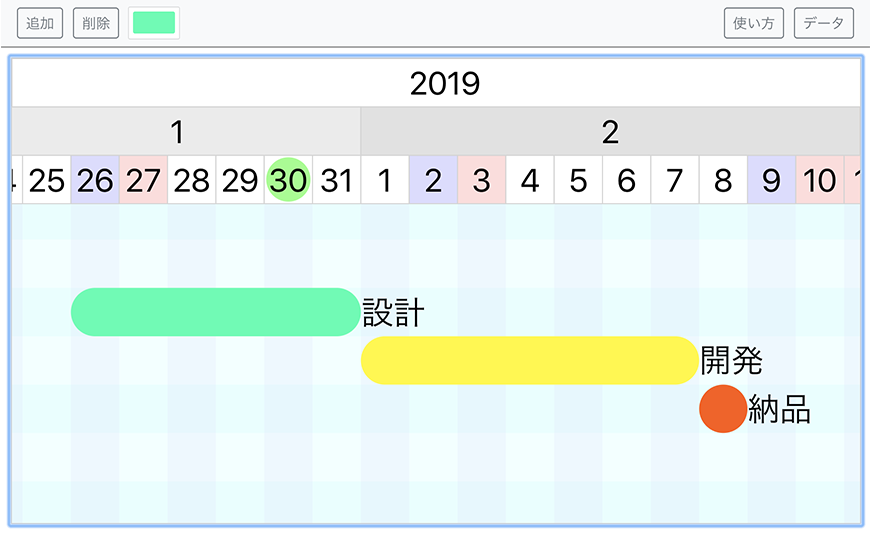

# Dora Scheduler

自由にバーを配置できるスケジュール管理アプリです。

<p align="center">
  
</p>

## デモアプリ

以下のページでデモアプリを試用できます。

[https://yamagame.github.io/dora-scheduler](https://yamagame.github.io/dora-scheduler)

## 準備

```
$ yarn i
```

## 開発方法

package.jsonの proxyをドラエンジンが起動しているラズベリーパイのホスト名に変更し、以下のコマンドを実行します。

```
$ yarn start
```

## ビルド方法

```
$ yarn run build
```

## License

[MIT](LICENSE)
